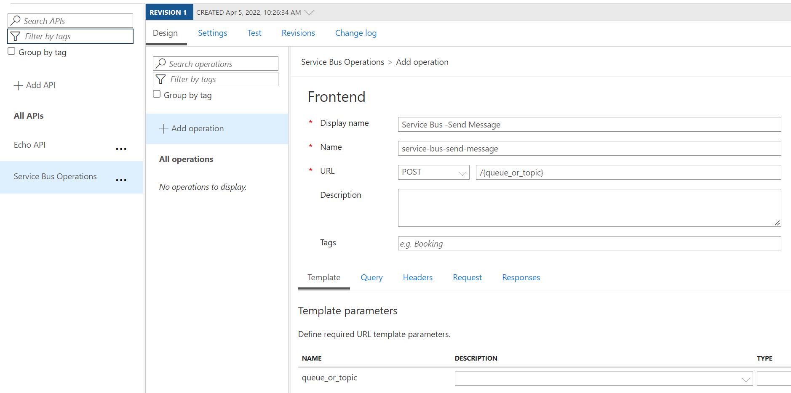

# Exposing Azure Service Bus REST APIs using API Management and Managed Identity

This tutorial will walk through setting up API Management policy for sending data to Azure Service Bus REST APIs. The API Management will use Managed Identity to access the Service Bus REST APIs.

## Create Resource Group

```bash
az login # Login via browser
az group create -n "<Your Resource Group Name>" -l "<Your Resource Location>"
```

## Deploy API Management

```bash
az deployment group create --resource-group "<Your Resource Group Name>" --template-file deploy/apim.bicep --parameters publisherEmail="<Your Email Address>" publisherName="<Your Name>" apimServiceName="<Unique APIM Service Name>"
```

The APIM deployment can take time to complete.

## Deploy Service Bus

```bash
az deployment group create --resource-group "<Your Resource Group Name>" --template-file deploy/service-bus.bicep --parameters nameSpace="<Unique Service Bus Namespace>"
```

## Assign Role to Service Bus for API Management Identity

The deployment below will assign the Azure Service Bus Data Sender role to API Management Identity.

```bash
az deployment group create --resource-group "<Your Resource Group Name>" --template-file deploy/roleAssign-apim-service-bus.bicep --parameters apimServiceName="<Your APIM Service Name>" sbNameSpace="<Your Service Bus Namespace>"
```

## Configure API Management API

1. Go to Azure Portal, login, locate the resource group you created earlier, and click on the API Management instance you created earlier.

1. In the APIs section click APIs, and under Define new API select HTTP.
    

1. In the Create an HTTP API, provide a display name, API URL suffix, and click Create.
    

1. Add an Operation, provide display name, set URL method to "POST" and the template path pointing to the queue or topic name {queue_or_topic}. The "{}" will capture this path and create a template parameter to use in our policy definitions.
    

1. Click Save. The Frontend definition should look as below with the "queue_or_topic" template parameter.
    

1. Click on the "</>" icon to edit the policies.
    

1. Configure the inbound policy using the XML snippet below. Make sure to replace the "\<Your Service Bus Namespace\>" with your Namespace.
    ```xml
    <inbound>
        <base />
        <!-- Set variable for the queue or topic to send the message to. This comes from the request. -->
        <set-variable name="queue_or_topic" value="@(context.Request.MatchedParameters["queue_or_topic"])" />

        <!-- Use Managed Identity for authorization to send data to Service Bus and set the Authorization header. -->
        <authentication-managed-identity resource="https://servicebus.azure.net" output-token-variable-name="msi-access-token" ignore-error="false" />
        <set-header name="Authorization" exists-action="override">
            <value>@((string)context.Variables["msi-access-token"])</value>
        </set-header>

        <!-- Set the HTTP method to POST to Service Bus REST API. The request body is expected to be in JSON. -->
        <set-method>POST</set-method>
        <set-body>@{
                JObject json = context.Request.Body.As<JObject>(preserveContent: true);
                return JsonConvert.SerializeObject(json);
        }</set-body>

        <!-- Set the backend URL for the Service Bus REST API using the queue_or_topic variable set earlier. -->
        <set-backend-service base-url="https://<Your Service Bus Namespace>.servicebus.windows.net" />
        <rewrite-uri template="@("/" + (string)context.Variables["queue_or_topic"] +"/messages" )" copy-unmatched-params="false" />
    </inbound>
    ```

1. Use Postman or another tool to send a request as shown below to the "demo-queue" created during deployment. Make sure to send in the API key in the header "Ocp-Apim-Subscription-Key".
    

1. Go to your Service Bus Namespace in Azure Portal, click on Queues, select "demo-queue", click Service Bus Explorer, click the "Peak" tab, and Peak. Select the message and the popup will show the message content.
    
