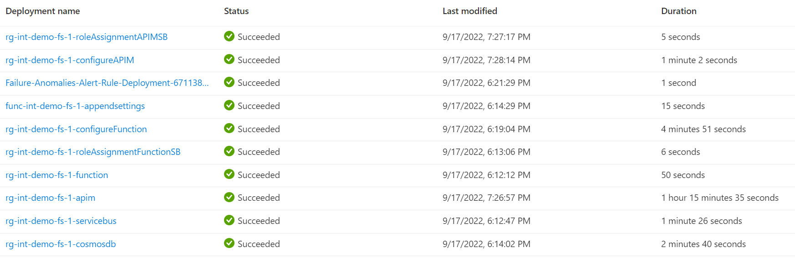
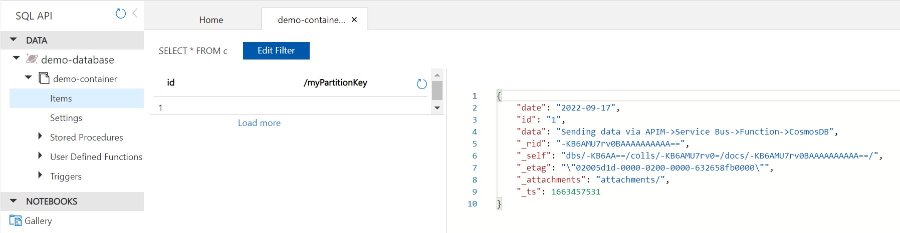

# Exposing Azure Service Bus using API Management

This tutorial will walk through setting up API Management policy for sending data to Azure Service Bus. The API Management will use Managed Identity to access the Service Bus REST APIs. A Function is triggered when a message is queued in Service Bus, and it will write message data to Cosmos DB. The Function App will use Managed Identity to get access to Service Bus. This is a typical integration scenario leveraging APIs

In the below architecture, Azure Function App processes the messages by simply writing the data to the Cosmos DB. The function can be extended to a durable function that orchestrates normalization and correlation of data prior to persisting to the Cosmos DB. Other potential extensions of use cases for this architecture are:

1. Integrate backend systems using message broker to decouple services for scalability and reliability. Allows work to be queued when backend systems are unavailable.
1. Extended to other consumers of the messages. Services such as Durable functions/Logic Apps to orchestrate workflows, or Microservices running in Container Apps/AKS to process the workload.
1. API Management provides the publishing capability for HTTP APIs, to promote reuse and discoverability. It can manage other cross-cutting concerns such as authentication, throughput limits, and response caching etc.
1. Provide load leveling to handle bursts in workloads and broadcasting of messages to multiple consumers.

Below architecture is deployed in this demonstration.


Azure Services used:

1. API Management
1. Service Bus
1. Function App
1. Application Insights
1. Storage Account
1. Cosmos DB

The client can be simulated using curl, or any other tool that can send HTTP request to APIM gateway.

## Deploy solution to Azure

### Prerequisites

1. Local bash shell with Azure CLI or [Azure Cloud Shell](https://ms.portal.azure.com/#cloudshell/)
1. Azure Subscription. [Create one for free](https://azure.microsoft.com/en-us/free/).
1. Clone or fork of this repository.

### Deploy

Login to your Azure in your terminal.

```bash
az login
```

To check your subscription.

```bash
az account show
```

Run the deployment. The deployment will create the resource group "rg-\<Name suffix for resources\>". Make sure you are in the APIM-SB-ManageIdentity directory.

```bash
az deployment sub create --name "<unique deployment name>" --location "<Your Chosen Location>" --template-file infra/main.bicep --parameters name="<Name suffix for resources>" publisherEmail="<Publisher Email for APIM>" publisherName="<Publisher Name for APIM>" 
```

The following deployments will run:



>**NOTE**: The APIM deployment can take over an hour to complete.

## Validate Deployment

1. Use Curl or another tool to send a request as shown below to the "demo-queue" created during deployment. Make sure to send in the API key in the header "Ocp-Apim-Subscription-Key".

    ```bash
    curl -X POST https://<Your APIM Gateway URL>/sb-operations/demo-queue -H 'Ocp-Apim-Subscription-Key:<Your APIM Subscription Key>' -H 'Content-Type: application/json' -d '{ "date" : "2022-09-17", "id" : "1", "data" : "Sending data via APIM->Service Bus->Function->CosmosDB" }'
    ```
    If using PowerShell use Invoke-WebRequest:

    ```
    Invoke-WebRequest -Uri "https://<Your APIM Gateway URL>/sb-operations/demo-queue" -Headers @{'Ocp-Apim-Subscription-Key' = '<Your APIM Subscription Key>'; 'Content-Type' = 'application/json'} -Method 'POST' -Body '{ "date" : "2022-09-17", "id" : "1", "data" : "Sending data via APIM->Service Bus->Function->CosmosDB" }'
    ```


1. Go to your deployment of Cosmos DB in Azure Portal, click on Data Explorer, select "demo-database" and the "demo-container”, click Items. Select the first item and view the content. It will match the data submitted to the APIM gateway in step 1.
    
    

## Disclaimer

The code and deployment biceps are for demonstration purposes only.
