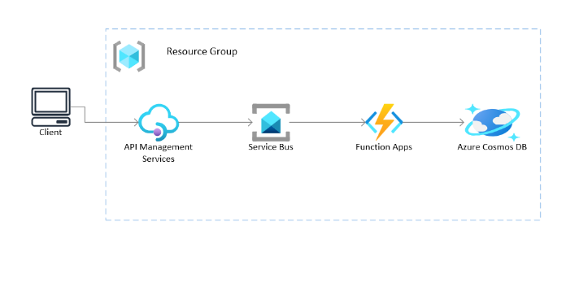

# Exposing Azure Service Bus REST APIs using API Management and Managed Identity

This tutorial will walk through setting up API Management policy for sending data to Azure Service Bus REST APIs. The API Management will use Managed Identity to access the Service Bus REST APIs.

Below is the architecture that is deployed



The client can be simulated using curl, Postman, or any other tool that can send HTTP request to APIM endpoint.

## Deploy solution to Azure

```bash
az login # Login via browser
az deployment sub create --location "<Your Chosen Location>" --template-file infra/main.bicep --parameters name="<Name suffix for resources>" publisherEmail="<Published Email for APIM>" publisherName="<Publisher Name for APIM>" 
```

NOTE: The APIM deployment can take up to one hour to complete.

## Validate Deployment
1. Use Postman or another tool to send a request as shown below to the "demo-queue" created during deployment. Make sure to send in the API key in the header "Ocp-Apim-Subscription-Key".
    

1. Go to your Service Bus Namespace in Azure Portal, click on Queues, select "demo-queue", click Service Bus Explorer, click the "Peak" tab, and Peak. Select the message and the popup will show the message content.
    
